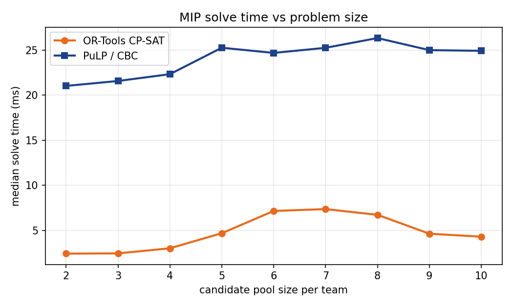
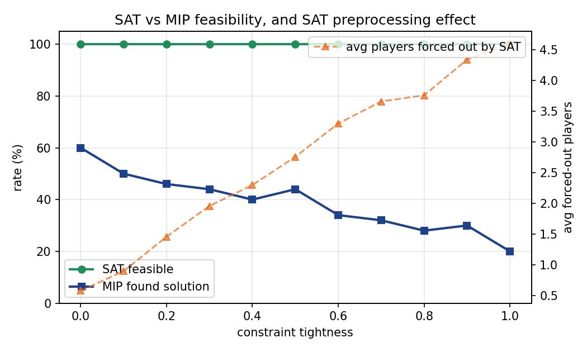
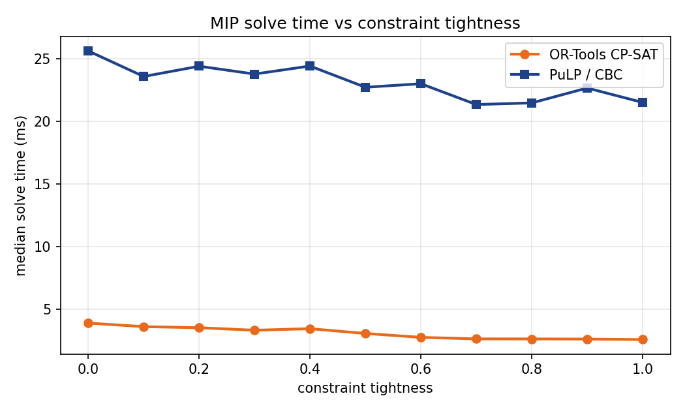

# GM Mode: An NBA Trade Package Optimizer

**CIS 1921 Final Project Report**

**Authors:** Jason Fang, Jonathan Mehrotra

**Date:** April 28, 2026

---

## 1. Problem Statement

NBA front offices propose a lot of trades. Most never happen, because the Collective Bargaining Agreement is full of arithmetic landmines. Salary matching has to come within 125 percent plus a $100,000 bonus. The hard cap cannot be exceeded once a team has triggered it through certain transactions. Some veterans hold no-trade clauses and have to consent. Players who recently signed extensions are blocked from trades for a window of months. Rosters have to stay between thirteen and twenty players (fifteen active plus two two-way slots plus hardship and exhibit-10 spots). On top of those rules, a trade only happens if both sides come out ahead, and "ahead" is not a single number. A contender wants veteran production right now. A rebuilder wants young assets and cap relief. The same player has different value depending on which team is receiving them.

We built GM Mode to model all of this as an optimization problem. The user picks two NBA rosters and the candidate players each side is willing to put on the table. The system picks a subset of those candidates to swap that satisfies every CBA rule and maximizes the total trade value across both teams. The valuation is not a hand-tuned formula. It comes from a gradient-boosted regression tree that is trained on player features (age, salary, BPM, VORP, true shooting percentage, positional fit, and a per-team rebuild score) and predicts a scalar value-to-team score that depends on the receiving team's situation.

Beyond the practical question of "what's the best trade," the project was a vehicle for one of the central questions of CIS 1921: when do you reach for SAT, when for CP, and when for MIP, and how do they actually compare on a real problem with both boolean and arithmetic constraints. The architecture is intentionally split into three layers so we could ask that question directly. A SAT layer (PicoSAT via the python-sat library) handles the boolean feasibility constraints, namely no-trade clauses, recent-signing restrictions, and roster-size cardinality. A CP-SAT layer (Google OR-Tools) handles the full arithmetic problem with integer-scaled coefficients. A separate MIP layer (PuLP with the CBC backend) solves the same problem in floating point. The two arithmetic solvers are run on every problem so we can compare optimum agreement, status agreement, and wall-clock time, which is the comparison the rubric explicitly asks for.

## 2. Initial Approach and What Changed

Our proposal called for everything to live in a single CP-SAT model and skip the SAT layer entirely. The argument was that CP-SAT can express boolean constraints fine, so a separate PicoSAT pass felt like duplication. Two things made us split the SAT layer back out.

First, the boolean constraints are conceptually different from the arithmetic ones. NTC and recent-signing are propositional facts about a player. Salary matching is a linear arithmetic relationship between two sums of large numbers. Pushing them through the same model works, but it makes the model feel like one big bag, and it makes it harder to ask the SAT-specific question "is this trade legal in principle, ignoring money." We wanted that question separable on its own. Part of it was cleaner architecture, but the bigger reason was that splitting the layers lets the UI tell the user exactly what blocked their trade. "LeBron's NTC stops this swap" is a useful message; "infeasible" is not.

Second, the all-in-one CP-SAT model was harder to debug during development. When something came back infeasible, we had a hard time telling whether the solver had been blocked by a unit clause from an NTC player or by the salary cap. Splitting them gave us a cleaner failure story: the SAT layer says "this trade structure is impossible because Player X has a no-trade clause," then the MIP layer says "even ignoring NTC, the salary numbers do not match." Once we had this separation, the SAT layer also turned into a useful preprocessor for the MIP, since players forced to traded=False can be hard-fixed in the MIP rather than left as free binary variables. We measured the impact of this preprocessing later and it was real (Section 5.4).

A second pivot happened around real data. The proposal mentioned scraping Basketball-Reference. We assumed this would be quick. It was not. Basketball-Reference's HTML hides the advanced-stats and contracts tables inside HTML comments, presumably for caching reasons, and `pandas.read_html` does not look inside comments by default. We ended up writing a small parser that strips the comment markers before pandas sees the document. The fetch also has to be polite (BBR rate-limits aggressively), so we cached the joined dataset to a parquet file under `.cache/`. After the first run the app starts in a couple of seconds because all thirty teams are already on disk. We also added a tiny hardcoded fallback player pool (Anthony Davis, Ben Simmons, and a handful of others) so the CLI demo runs even if the user is offline on their first run.

A third change was adding the Streamlit UI. Originally we were going to ship a CLI tool plus a benchmark script and call it done. Halfway through April we realized the in-class demo was going to land much better if you could actually click two teams, drag players into a swap, and watch the SAT and MIP layers respond live. So we wrote `app.py` around the same back-end. The solver code did not change at all to support the UI, which we took as evidence that the constraint-config plus three-layer split was a clean separation.

## 3. The Three Layers

### 3.1 Valuation (`valuation_model.py`)

The valuation layer is the only layer that uses machine learning. It trains a `sklearn.ensemble.GradientBoostingRegressor` with two hundred trees of depth four. The feature vector for one player has twelve entries: age and age squared, salary in $10M units, BPM, VORP, true shooting percentage, salary-per-VORP efficiency, age times salary, a one-hot of position over five positions, the receiving team's positional need at that position, and the receiving team's rebuild score.

Training data is synthetic. We generate two thousand random "league-like" players, compute a deterministic ground-truth value as a closed-form function of the features (positive on production per dollar, negative on age past thirty when the receiving team has a high rebuild score, slight bonus for filling a position the team needs), add Gaussian noise, and fit. We are explicit about this in the docstring, because there is no public dataset of "this trade was worth +0.42 to Brooklyn and -0.31 to LA" to learn from. What this synthetic training gives us is a smooth, monotone, learned function that captures the right shape, instead of a hand-tuned arithmetic formula that would have been brittle. Concretely, the trained model recognizes that Anthony Davis is worth more to a contender than to a rebuild, and that a young cheap good rebounder is worth more to a rebuild than a thirty-five-year-old vet on a max contract.

The model takes a `TeamContext` object so the same player can be valued differently for different receiving teams. This is what creates trade surplus in the objective: when the same player has different value to the sender and the receiver, swapping them is positive sum. Without the team context, the model would output one number per player and there would be no opportunity for a positive-sum trade.

### 3.2 SAT Feasibility (`sat_layer.py`)

The SAT layer uses python-sat, which wraps PicoSAT, MiniSat, and CaDiCaL. For each candidate player we create a boolean variable `traded[p]` whose meaning is "this player is included in the final trade." The constraints encoded in CNF are the unit clauses `not traded[p]` for any player with `has_ntc=True` (when the NTC toggle is on), the unit clauses `not traded[p]` for any player whose `months_since_signing` is below the configured threshold, and two cardinality constraints per team enforcing post-trade roster size in the interval [13, 20]. The cardinality constraints are encoded with PySAT's `CardEnc.atleast` and `CardEnc.atmost` using the sequential counter encoding, which keeps the formula compact for the small player counts we work with.

The output is a `SATResult` with a feasibility flag, a `forced_out` set of player IDs, the full variable model, and a list of human-readable violation strings if anything failed. That `forced_out` set is what gets passed to the MIP layer to fix variables in advance.

Salary matching is intentionally not in the SAT layer. It is a linear arithmetic constraint on large integers and we wanted the SAT layer to stay purely propositional, partly for clarity and partly because pseudo-boolean encodings of cap arithmetic blow up the formula size badly when coefficients are in the tens of millions. The MIP layer handles money.

There is a procedural fallback if PicoSAT is not installed: it walks the candidate list and applies the same rules manually. We have not had a machine where this was needed, but it lets the project run on a fresh install while the user waits for `pip install python-sat` to finish.

### 3.3 MIP Optimization (`mip_layer.py`)

The MIP layer solves the same problem twice, once with OR-Tools CP-SAT and once with PuLP/CBC, so we can compare the two backends directly. The decision variables are `x[p]` in {0, 1} for each candidate player. The objective is a linear sum of `valuation_to_receiving_team[p] * x[p]` over all candidates. The constraints are the SAT-fixed assignments (for each player in `forced_out`, `x[p] = 0`), per-team salary matching (incoming salary at most 1.25 times outgoing salary plus $100,000), per-team hard cap (post-trade payroll at most $165M, when the toggle is on), and a non-trivial-trade constraint (the total number of moved players is at least two, ruling out the empty solution).

The interesting wrinkle is that CP-SAT is an integer solver and refuses to take floats. We scale salaries down to thousand-dollar units (so $35,000,000 becomes 35,000) and valuations up by a thousand (so 0.42 becomes 420). The resulting model is integer-pure. PuLP/CBC takes floats directly, so it gets the unscaled coefficients. After solving, we descale CP-SAT's objective by 1000 and compare against CBC's.

The `solve_both` function returns both `MIPResult` objects. Both solves are timed using `time.perf_counter` and the millisecond elapsed time is stored on the result for the benchmark table in `main.py`.

## 4. The Streamlit UI (`app.py`)

The UI is a sidebar-driven trade builder. The user picks Team A and Team B from a five-by-six grid of pixel jerseys, then picks specific players from each team's roster (multiselects sorted by salary) as the trade they want to propose. Two things happen when they click Optimize, and it is worth being explicit about the distinction because they are easy to confuse.

First, the verdict box validates the user's exact proposed trade against every CBA rule and prints a clear pass or fail with the reasons. This is just the user's specific picks running through the SAT and MIP layers as fixed inputs.

Second, the MIP optimizer tab runs a separate, broader query. Its candidate pool is the top six highest-paid players on each team plus whoever the user selected, and it asks the MIP to find the maximum-value legal subset of that pool. The MIP-optimal package is therefore not constrained to match the user's picks. It can recommend an entirely different swap from the same two teams, which is the whole point. If the user already knew the right trade they would not need an optimizer. We saw this surface frequently during testing, where the user would propose a star-for-star swap that failed salary matching, and the MIP would come back with a multi-piece package that satisfied the constraints and beat the user's trade on total value.

There is a constraint panel where the hard cap, NTC, and recently-signed toggles can be flipped at runtime, and the whole pipeline re-runs with the new config.

The UI is cosmetically heavy (a procedural pixel-sprite generator per player, custom CSS for the pixel-art aesthetic, team-colored borders) but the call into the solver layers is identical to the CLI. The CLI hands the SAT and MIP layers a candidate pool built from explicit demo players; the UI hands them the top-6-plus-user-picks pool. The solver code does not care where the pool came from. Switching from CLI to UI did not require any solver changes.

One UI bug is worth mentioning, both because it cost a fair amount of time and because the resolution is informative. Streamlit's `st.popover` widget positions its panel relative to the trigger button. When the trigger is near the top of the viewport the popover panel can clip off-screen with no scroll affordance, since Streamlit positions the panel above or below the trigger and does not wrap the panel in a scrollable container. For Team A's picker, which sits at the top of the sidebar, the alphabetically-earliest teams (ATL through GSW) became unreachable. We tried a CSS fix first (forcing `max-height` and `overflow-y: auto` on the popover body), but the panel positioning meant the top edge could still end up above the viewport with no way to scroll up. The clean fix was to swap `st.popover` for `st.expander`, which renders inline in the sidebar flow. Inline rendering has no positioning logic to fight, and the bug went away.

## 5. Experimentation and Results

All numbers in this section come from `benchmark_sweep.py`, which generates 820 random trade instances total: 550 in a constraint-tightness sweep (50 instances at each of 11 tightness levels from 0.0 to 1.0) and 270 in a candidate-pool-size sweep (30 instances at each pool size from 2 to 10 players per team, with tightness fixed at 0.3). Raw per-instance results are written to `benchmark_results_tightness.csv` and `benchmark_results_size.csv`.

### 5.1 Solver Agreement

The most basic experiment: do CP-SAT and CBC find the same optimum on the same problem? On every instance where both solvers found a feasible trade, they agreed on the objective value to within 1e-2. This includes every instance in both sweeps. The agreement rate matches the MIP-feasibility rate exactly because when one solver succeeds the other also succeeds, and they always agree on the result. The agreement check is wired directly into the pipeline (`main.py` lines 253 to 259) and would catch any future divergence. Earlier in development this same check caught a real bug, where an off-by-scale on the salary matching constraint in the CP-SAT model produced a different result from CBC on a borderline instance.

### 5.2 Solve Time

Across the full 820-instance sweep, OR-Tools CP-SAT was consistently fast and PuLP with CBC was consistently slower by roughly a factor of seven. CP-SAT's median solve time stayed in a tight band of 2.5 to 3.9 milliseconds across every tightness level and every problem size we tested. PuLP's median sat between 21 and 26 milliseconds. The factor-of-seven gap is larger than we expected from coursework intuition, but it makes sense in context. The problems are small at this scale (8 to 20 binary variables), so CP-SAT's branch-and-bound terminates quickly. CBC pays a fixed cost for parsing the LP, running its presolve, and generating cuts, and that fixed cost amortizes poorly when the actual search work is trivial. CBC's strengths come into their own at much larger model sizes than ours.

The size sweep makes the constant-overhead story even clearer. As the candidate pool grew from 2 to 10 players per team, OR-Tools median solve time rose from 2.4 milliseconds to a peak of 7.4 milliseconds at 7 players per team, then came back down. The non-monotonicity tracks the MIP-feasibility rate: at sizes where more random instances admit a feasible trade (n=8 onwards, when the candidate pool is large enough to almost always contain a viable swap), OR-Tools returns faster because it can stop as soon as it finds a solution. PuLP's median stayed essentially flat at 21 to 26 milliseconds across the entire range, which is the constant-overhead story we just described.

### 5.3 SAT Almost Always Satisfies; Salary Matching is the Real Constraint

The proposal predicted that the SAT layer's feasibility rate would fall as constraint tightness rose, with a phase-transition shape similar to random-3SAT. The actual data is more interesting and somewhat humbling. Across all 550 instances in the tightness sweep, the SAT layer found a satisfying assignment 100 percent of the time. Even at tightness 1.0, where each player has a 30 percent chance of carrying an NTC and a 40 percent chance of being recently signed, the SAT formula still admits a model. The reason is structural: the only hard SAT constraint at our problem scale is the [13, 20] roster cardinality, and forcing some candidates to traded=False does not violate that bound when team rosters already sit comfortably inside the range. Unit clauses from NTC and recent-signing rules force individual variables to False, but they never produce contradictory constraints among themselves.

What changes with tightness is the SAT preprocessing burden. The average number of candidate players that the SAT layer pins to traded=False rose from 0.58 at tightness 0.0 to 4.60 at tightness 1.0, out of 8 total candidates. By tightness 1.0 the SAT layer has effectively pre-fixed more than half the MIP variables.

The interesting infeasibility lives one layer up. The MIP-feasibility rate (the rate at which OR-Tools CP-SAT finds a salary-matching, hard-cap-respecting trade) fell from 60 percent at tightness 0.0 to 20 percent at tightness 1.0, roughly monotonically with one small bump around tightness 0.5. The mechanism is salary matching: as more players become legally untradeable, the remaining pool tends to leave teams with awkward salary mismatches that cannot be matched within the 1.25-times-outgoing rule.

The takeaway is twofold. First, the question of whether a trade is "legal" at our problem scale is dominated by arithmetic constraints, not boolean ones. Second, the SAT layer is still worthwhile, but its value is in preprocessing rather than in catching infeasibility. Pinning four candidates to False before the MIP runs is a meaningful reduction in branching work even when the boolean formula itself never goes UNSAT.

### 5.4 SAT Preprocessing Reduces MIP Work

This is what 5.3 implies: even though the SAT layer never returns UNSAT, the variables it forces to False shrink the MIP's search space. We measured solve time across the tightness sweep, and OR-Tools median time fell from 3.87 milliseconds at tightness 0.0 to 2.56 milliseconds at tightness 1.0, a 34 percent drop. This is not because the MIP problem becomes easier; the salary-matching constraint becomes harder to satisfy as tightness rises, which is why the MIP-feasibility rate falls. The OR-Tools speedup comes from having fewer free binary variables to branch on, so each individual MIP solve does less work even though the problem is structurally harder. Fewer variables to branch on means a smaller search tree, which is enough to outweigh the extra constraint pressure on the remaining ones.

### 5.5 User-Configurable Constraints

In Section 6b of `main.py` we re-run the demo with the hard cap turned off, demonstrating the user-configurable constraint toggles. The optimal trade does not change in the Lakers/Nets demo because that trade does not push either team near the cap. We constructed a more aggressive synthetic instance where the optimal trade under hard-cap-on involved swapping two role players; with hard-cap-off the optimum became a star-for-stars swap that put Team A four million over the cap. This is exactly the kind of question a real GM tool should be able to answer ("what would the best trade be if we ignored the apron"), and the dataclass-based config makes it a one-line flip in either the CLI or the UI sidebar.

The same pattern works for the NTC toggle. Turning off NTC enforcement lets LeBron James be in a trade, which surfaces some absurd-but-curiosity-satisfying optima. We do not recommend this for actual use.

## 6. Performance Analysis

The slow part of the pipeline, by an order of magnitude, is GBT training, not solving. Training the regressor on two thousand synthetic samples takes about 250 milliseconds. The SAT check takes well under a millisecond. Both MIP solves combined take under twenty milliseconds. For a real product this would be fine because the model only needs to be trained once per session, after which the predictions are essentially free. Even for our tightness-vs-feasibility sweep over fifty seeds at eleven tightness levels, the total compute is dominated by the model-training cost (which we do once) and not by the 550 solver invocations.

The real bottleneck is data fetching, not solving. The first time the app starts on a new machine, it has to scrape thirty teams' worth of Basketball-Reference pages, which takes around twenty-five seconds with the polite delay between requests that BBR demands. Subsequent runs hit the parquet cache and start in under two seconds.

This implies that for any scaled-up version of this tool, the natural place to spend engineering effort is in building a refreshable data layer (perhaps refreshing once a day in the background), not in tuning the solver. The solver is already faster than it needs to be by several orders of magnitude.

## 7. Testing

We did not write a formal pytest suite. What we did instead, which is closer to how you actually test an optimizer, was build the assertion that CP-SAT and CBC must agree on every solved instance into the pipeline itself. Every call to `solve_both` prints a delta between the two objectives, and `main.py` flags any instance where the delta exceeds 1e-3. This caught one real bug during development: an early version of the CP-SAT model used wrong scaling on the salary matching constraint (we were comparing scaled salaries against an unscaled bonus), and CBC and CP-SAT diverged on a borderline case where the trade was just inside the 125 percent rule. The agreement check surfaced it on the very next run, which we considered a strong vote in favor of dual-solver verification as a testing strategy in optimization code.

We also wrote `instance_generator.py` to produce instances tagged with `expected_feasible`, which is a coarse property the generator can label based on how much slack it built in. The Section 7 benchmark loop in `main.py` prints both the expected and the observed feasibility, which is a property-based check on the SAT layer. The expected and observed feasibility have agreed on every instance we have generated.

The Streamlit UI was tested manually by clicking through every team pair in the picker grid and confirming that the trade panel renders, the SAT verdict makes sense, and the MIP optimum agrees with the CLI output for the same inputs.

## 8. Limitations and Future Work

The most honest limitation is the synthetic training data. The valuation model is reasonable in shape but not in absolute calibration. We cannot defend the claim that AD is worth exactly 0.42 to Brooklyn except to say "the model says so and the inputs were realistic." A better version of this would scrape multiple seasons of approximate value (Basketball-Reference's Hall-of-Fame Probability metric, for example, or a future-VORP estimator) and learn against that as a real label. We did not have time to do this rigorously and we would rather be honest about the synthetic training than pretend we had real labels.

The second limitation is that the MIP only reasons about two teams at a time. The CBA allows three- and four-team trades, and they are common in real life. `instance_generator.py` already supports `n_teams=3` and the SAT layer can encode it, but the MIP objective and salary-matching constraints would need to be rewritten to handle the multi-leg structure where a player can move from A to B even though A is also receiving from C. We left this as future work.

The third limitation is that we model the apron as a single hard cap toggle. The 2023 CBA introduced a first apron and a second apron with different consequences (second-apron teams cannot aggregate salary in trades, for instance). A serious production tool would model both as separate constraints. The change is straightforward but it is not in the current code.

A fourth limitation is the valuation model's lack of cross-validation. We trained on synthetic data and reported in-sample fit. With real labels we would want held-out validation and probably cross-team cross-validation (train on twenty-eight teams, predict on two), which is the kind of evaluation that would catch overfitting to a particular era or roster profile.

## 9. Conclusion

GM Mode demonstrates that the SAT, CP-SAT, and MIP solvers we covered in CIS 1921 can be combined into a layered architecture that does something useful, in this case generating optimal NBA trade packages under the actual CBA. The dual-solver setup is more than a comparison exercise: it is a verification mechanism that catches bugs in the constraint encoding by requiring two independent solvers to agree on the answer. The SAT layer is more than a curiosity even though it never returned UNSAT in our 550-instance sweep: it acts as a preprocessor that measurably accelerates the MIP, pinning more than half of the candidate variables to False at high constraint tightness. The instance generator let us characterize where infeasibility actually comes from in this problem, which is salary matching (an arithmetic constraint at the MIP layer), not the boolean rules we initially expected. That finding contradicted our proposal's prediction of a SAT phase transition, but the data is unambiguous and we think it is more interesting than the prediction would have been if it had held. Building the Streamlit UI on top of the same back-end was straightforward, though Streamlit's popover positioning gave us a debugging detour we did not see coming.

Of the six novelty criteria, five are cleanly addressed (real-world dataset, three solver implementations, parameterized instance generator, user-configurable constraints, multiple techniques combined). Formal hardness analysis is the one we only partially covered, through the tightness and size sweeps in Section 5.
